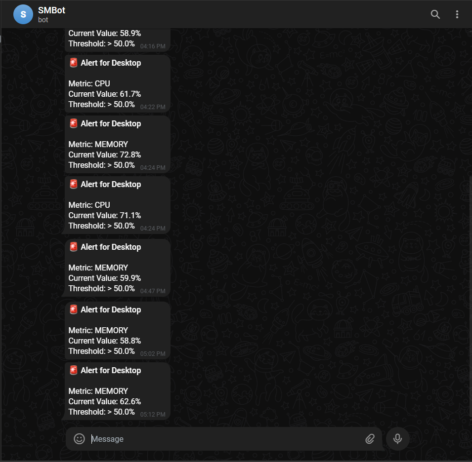

<strong><h1>StatusMonitor</h1></strong>
<strong>Real-time system monitoring with a modern web dashboard and cross-platform agent</strong>

📋 Table of Contents

Overview

Features

Architecture

System Design Decisions

Quick Start

Deployment

Agent Setup

API Reference

Configuration

Alerting Setup

Troubleshooting

Project Structure

License

Overview

StatusMonitor is a comprehensive system monitoring solution that collects, stores, and visualizes real-time metrics from multiple machines. It features a modern React dashboard with interactive charts, WebSocket-based live updates, and historical data analysis powered by Apache Kafka for reliable event streaming.

<em>User Home Page</em>

<em>Dashboard - Real-time metrics with interactive charts</em>

<em>Agent Registration - Create and register monitoring agents</em>

<em>Alerts - Configure threshold-based Telegram notifications</em>

<em>Telegram Alert - Real-time notification when threshold is breached</em>

<em>Extended CPU Modal - Per-core usage and frequency details</em>

Key Components

Component

Technology

Purpose

Frontend

React 19 + Vite + Tailwind CSS

Interactive web dashboard

Auth Service

FastAPI + PostgreSQL

User authentication & agent management

Ingestion Service

FastAPI + Kafka

Metrics collection & event streaming

Distribution Service

FastAPI + WebSocket + Kafka

Real-time data broadcast

History Service

FastAPI + InfluxDB + Kafka

Time-series storage with downsampling

Alert Service

FastAPI + Kafka + Telegram

Threshold-based alerting with history

Agent

Python + tkinter

Cross-platform metrics collector

Features

🖥️ Dashboard

Real-time Metrics: Live CPU, memory, disk, and network monitoring

Interactive Charts: Clickable graphs with extended modal views

Per-Core CPU Monitoring: Detailed view with individual core usage and frequencies

Historical Analysis: Query metrics over custom time ranges (5m, 1h, 24h, 7d)

Multi-Agent Support: Monitor multiple machines from a single dashboard

📊 Data Pipeline

Kafka Event Streaming: Durable message queue with 24-hour retention

Tiered Storage: Three retention tiers for optimal storage efficiency

Raw data (5s resolution) → 24 hours

1-minute aggregates → 7 days

1-hour aggregates → 1 year

Automatic Downsampling: InfluxDB tasks aggregate data between tiers

Smart Query Routing: API automatically selects optimal data bucket based on time range

🔐 Security

JWT Authentication: Secure token-based auth with refresh tokens

Argon2 Password Hashing: Industry-standard password security

Per-Agent Tokens: Isolated access tokens for each monitoring agent

Token Expiration: 5-minute activation window prevents token reuse/theft

One-Time Activation: Tokens become permanent only after first successful connection

WebSocket Authentication: Real-time connections require valid JWT tokens

Data Isolation: Users can only access their own agents' metrics and history

📱 Agent

Cross-Platform: Windows, Linux, and macOS support

GUI Application: User-friendly tkinter interface

Real CPU Frequency: Windows PDH integration for accurate turbo boost readings

Configurable Interval: Adjustable metrics collection frequency

Standalone Build: Package as single executable with PyInstaller

🔔 Alerting

Telegram Notifications: Instant alerts via Telegram bot

Threshold Rules: Configure CPU, memory, and disk thresholds per agent

Per-Metric Cooldown: Separate 5-minute cooldown timers for each metric type

Immediate Triggering: Alerts fire instantly if threshold already exceeded when rule is created

Alert History: Full log of all fired alerts with filtering and sorting

Architecture

graph TD
    %% Clients and Agents
    User((User / Browser))
    Agent((Monitoring Agent))
    Telegram([Telegram API])

    %% Firewall / Entry Points
    subgraph "Public Interface"
        Nginx[Frontend / Nginx Reverse Proxy]
        IngestExt[Ingestion Endpoint :8001]
    end

    %% Internal Docker Network
    subgraph "Backend Services Cluster"
        direction TB
        
        %% Core Services
        AuthSvc[Auth Service]
        IngestSvc[Ingestion Service]
        DistSvc[Distribution Service]
        HistSvc[History Service]
        AlertSvc[Alert Service]

        %% Message Broker
        Kafka{Apache Kafka}
        Zookeeper[Zookeeper]

        %% Data Stores
        Postgres[(PostgreSQL)]
        Influx[(InfluxDB)]
        Redis[(Redis Cache)]
    end

    %% Connections
    
    %% 1. Ingestion Flow
    Agent -- "HTTPS (JSON Metrics)" --> IngestExt
    IngestExt -- "Forward" --> IngestSvc
    IngestSvc -- "1. Validate Token" --> AuthSvc
    IngestSvc -- "2. Produce 'metrics' topic" --> Kafka

    %% 2. Real-time Flow
    Kafka -- "Consume 'metrics'" --> DistSvc
    DistSvc -- "WebSocket Stream" --> Nginx
    Nginx -- "WebSocket (WSS)" --> User

    %% 3. History Flow
    Kafka -- "Consume 'metrics'" --> HistSvc
    HistSvc -- "Write Points" --> Influx
    User -- "HTTPS (Get History)" --> Nginx
    Nginx -- "Proxy /api/history" --> HistSvc
    HistSvc -- "Query Data" --> Influx

    %% 4. Alerting Flow
    Kafka -- "Consume 'metrics'" --> AlertSvc
    AlertSvc -- "Read Rules" --> Postgres
    AlertSvc -- "Check Cooldowns" --> Redis
    AlertSvc -- "Trigger Notification" --> Telegram

    %% 5. Auth & Metadata Flow
    User -- "HTTPS (Login/Mgmt)" --> Nginx
    Nginx -- "Proxy /api/auth" --> AuthSvc
    AuthSvc -- "Read/Write Users & Agents" --> Postgres
    
    %% Infrastructure Dependencies
    Kafka -.-> Zookeeper
    AlertSvc -.-> AuthSvc
    IngestSvc -.-> Redis
    
    %% Styling
    classDef service fill:#e1f5fe,stroke:#01579b,stroke-width:2px;
    classDef db fill:#fff9c4,stroke:#fbc02d,stroke-width:2px,shape:cylinder;
    classDef broker fill:#f3e5f5,stroke:#7b1fa2,stroke-width:2px,shape:rhombus;
    classDef actor fill:#e8f5e9,stroke:#2e7d32,stroke-width:2px;

    class AuthSvc,IngestSvc,DistSvc,HistSvc,AlertSvc,Nginx service;
    class Postgres,Influx,Redis,Zookeeper db;
    class Kafka broker;
    class User,Agent,Telegram actor;

Data Flow

Agents collect metrics every 5 seconds and POST to Ingestion Service.

Ingestion Service validates token and publishes to Kafka topic metrics.

Kafka provides durable message streaming with 24-hour retention.

Consumers process messages independently:

Distribution Service: Broadcasts to WebSocket clients in real-time.

History Service: Stores in InfluxDB tiered buckets with automatic downsampling.

Alert Service: Checks threshold rules, caches in Redis, sends Telegram notifications.

System Design Decisions

Why Event-Driven Architecture (Kafka)?

Instead of tight coupling between services, I implemented Apache Kafka as a central event backbone.

Decoupling: The Ingestion Service doesn't need to know if the Alert Service is online. It just produces events.

Backpressure: If the database slows down, Kafka buffers the messages, preventing the Agent from timing out.

Scalability: New consumers (e.g., an Analytics Service) can be added without modifying the ingestion logic.

Data Storage Strategy

Different data types require different storage engines:

Hot Data (Redis): Used for real-time alert cooldowns and caching active agent tokens for <1ms validation.

Time-Series Data (InfluxDB): Optimized for high-write ingestion of metrics. I implemented a Tiered Retention Policy:

Raw (5s): Kept for 24 hours for debugging.

Aggregated (1m): Kept for 7 days for recent trends.

Archived (1h): Kept for 1 year for long-term analysis.

Relational Data (PostgreSQL): Used for structured data like User Accounts, Agent Metadata, and Alert Rules where ACID compliance is critical.

Quick Start

Prerequisites

Docker Desktop (v20.10+)

Docker Compose (v2.0+)

Python 3.10+ (for running the agent locally)

1. Clone the Repository

git clone [https://github.com/NFRohan/statusmonitor.git](https://github.com/NFRohan/statusmonitor.git)
cd statusmonitor

2. Start All Services

Windows (PowerShell):

.\start-docker.ps1

Linux/macOS:

docker-compose up -d

3. Access the Dashboard

Open http://localhost:5173 in your browser.

4. Create an Account & Agent

Click Register and create an account.

Log in to the dashboard.

Navigate to the Agents page.

Click Create Agent and copy the generated token.
Note: Token expires in 5 minutes - use it promptly or regenerate.

5. Run the Agent

pip install psutil requests
python agent_service/gui_agent.py

In the agent GUI:

Go to Settings tab.

Paste your agent token.

Click Save Settings → Start Agent.

Deployment

Development Mode

Exposes all service ports for debugging:

Windows:

.\start-docker.ps1

Linux/macOS:

docker-compose up -d

Available Ports:
| Service | Port |
|---------|------|
| Frontend | 5173 |
| Auth Service | 8000 |
| Ingestion Service | 8001 |
| Distribution Service | 8002 |
| History Service | 8003 |
| Alert Service | 8004 |
| PostgreSQL | 5432 |
| Redis | 6379 |
| Kafka | 9092 |
| InfluxDB | 8086 |

Production Mode

Restricts exposed ports for security:

Windows:

.\start-docker.ps1 -Prod

Linux/macOS:

docker-compose -f docker-compose.yml -f docker-compose.prod.yml up -d

Production Ports:

Frontend: 80, 443

Ingestion Service: 8001 (for external agents)

Environment Configuration

Copy and edit the environment file:

cp .env.example .env

Generate a secure secret key:

python -c "import secrets; print(secrets.token_hex(32))"

Agent Setup

GUI Agent (Desktop)

pip install -r agent_service/requirements-gui.txt
python agent_service/gui_agent.py

Headless Agent (Server)

pip install -r agent_service/requirements.txt
export INGESTION_URL=http://your-server:8001
export AGENT_TOKEN=your-token
export COLLECTION_INTERVAL=5

python agent_service/main.py

Build Standalone Executable (Windows)

.\build_agent.ps1
# Output: dist/StatusMonitorAgent.exe

API Reference

Auth Service (:8000)

Endpoint

Method

Description

/register

POST

Create new user

/token

POST

Login (returns JWT tokens)

/refresh

POST

Refresh access token

/users/me

GET

Get current user info

/agents

GET/POST

List or create agents

/agents/{id}

DELETE

Delete an agent

/agents/{id}/regenerate-token

POST

Regenerate agent token

Ingestion Service (:8001)

Endpoint

Method

Description

/ingest

POST

Submit metrics (requires X-Agent-Token header)

History Service (:8003)

Endpoint

Method

Description

/history/{agent_id}/cpu

GET

CPU history

/history/{agent_id}/memory

GET

Memory history

/history/{agent_id}/disk

GET

Disk history

/history/{agent_id}/network

GET

Network history

/history/{agent_id}/summary

GET

Summary statistics

Query Parameters:

start: Time range start (-5m, -1h, -24h, -7d)

stop: Time range end (default: now())

interval: Aggregation interval (1m, 5m, 30m)

Automatic Bucket Selection:

≤24 hours → metrics_raw (5-second resolution)

24h - 7 days → metrics_1m (1-minute resolution)

7 days → metrics_1h (1-hour resolution)

Distribution Service (:8002)

Endpoint

Protocol

Description

/ws/{agent_id}?token=<jwt>

WebSocket

Real-time metrics stream

Alert Service (:8004)

Endpoint

Method

Description

/rules

GET/POST

List or create alert rules

/rules/{id}

DELETE

Delete alert rule

/recipient

GET/POST

Get or update Telegram settings

/history

GET/DELETE

Get or clear alert history

Configuration

Environment Variables

Variable

Default

Description

POSTGRES_PASSWORD

statusmonitor

Database password

SECRET_KEY

(required)

JWT signing key

KAFKA_BOOTSTRAP_SERVERS

kafka:29092

Kafka broker address

INFLUXDB_TOKEN

(required)

InfluxDB admin token

TELEGRAM_BOT_TOKEN

(optional)

Telegram bot for alerts

InfluxDB Buckets

Bucket

Retention

Resolution

metrics_raw

24 hours

5 seconds

metrics_1m

7 days

1 minute

metrics_1h

1 year

1 hour

Alerting Setup

1. Create a Telegram Bot

Message @BotFather on Telegram.

Send /newbot and follow prompts.

Copy the Bot Token.

2. Configure the Token

Add to .env:

TELEGRAM_BOT_TOKEN=your-bot-token

Restart alert service:

docker-compose up -d alert-service

3. Get Your Chat ID

Start a chat with your bot.

Send any message.

Visit: https://api.telegram.org/bot<TOKEN>/getUpdates

Find "chat":{"id":123456789}.

4. Configure in Dashboard

Go to Alerts page.

Enter your Chat ID.

Create alert rules with thresholds.

Troubleshooting

View Service Logs

docker-compose logs -f <service-name>

Health Checks
All services expose /health:

http://localhost:8000/health (Auth)

http://localhost:8001/health (Ingestion)

http://localhost:8002/health (Distribution)

http://localhost:8003/health (History)

http://localhost:8004/health (Alert)

Reset All Data

docker-compose down -v
docker-compose up -d

Agent Connection Issues

Verify ingestion service: curl http://localhost:8001/health

Check token validity (5-minute expiration for new tokens)

Regenerate token from Agents page if expired

Project Structure

statusmonitor/
├── agent_service/          # Python monitoring agent
│   ├── gui_agent.py        # GUI application
│   ├── main.py             # Headless agent
│   └── metrics.py          # Metrics collection
├── auth_service/           # Authentication service
├── distribution_service/   # WebSocket broadcasting
├── history_service/        # InfluxDB storage
│   └── influxdb_setup.py   # Bucket & downsampling setup
├── alert_service/          # Telegram alerting
├── ingestion_service/      # Metrics ingestion + Kafka producer
├── frontend/               # React dashboard
├── docker-compose.yml      # Development config
├── docker-compose.prod.yml # Production overrides
└── .env.example            # Environment template

License

MIT License - See LICENSE for details.

Built with ❤️ using FastAPI, React, Kafka, and Docker

