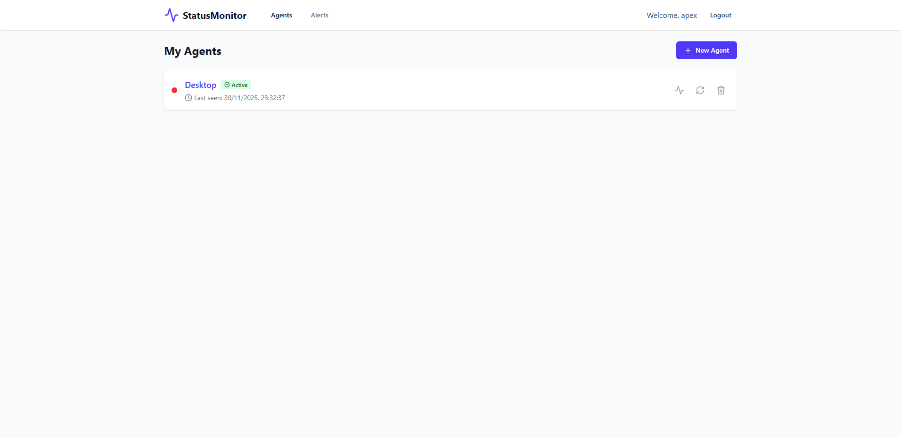
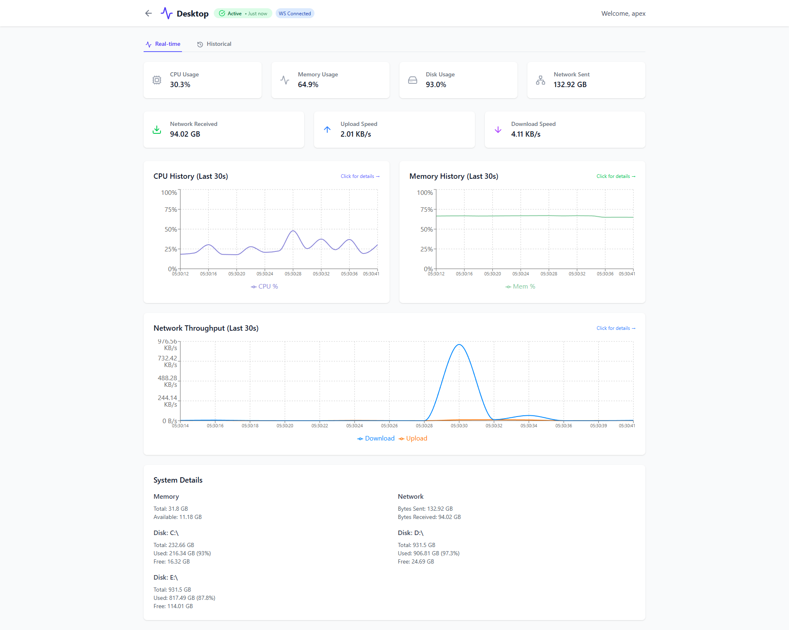
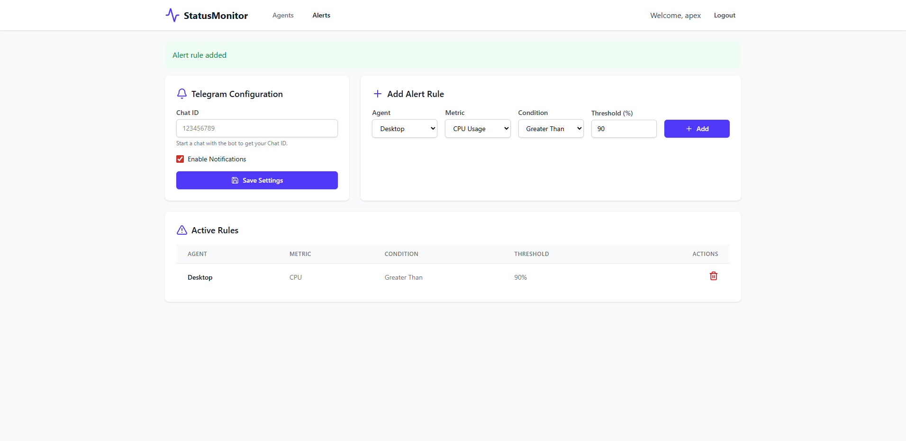

# StatusMonitor

<p align="center">
  <strong>Real-time system monitoring with a modern web dashboard and cross-platform agent</strong>
</p>

<p align="center">
  
  
  
  
  
</p>

---

## 📋 Table of Contents

- [Overview](#overview)
- [Features](#features)
- [Architecture](#architecture)
- [Quick Start](#quick-start)
- [Deployment](#deployment)
  - [Development Setup](#development-setup)
  - [Production Deployment](#production-deployment)
- [Agent Setup](#agent-setup)
- [API Reference](#api-reference)
- [Configuration](#configuration)
- [Troubleshooting](#troubleshooting)
- [License](#license)

---

## Overview

StatusMonitor is a comprehensive system monitoring solution that collects, stores, and visualizes real-time metrics from multiple machines. It features a modern React dashboard with interactive charts, WebSocket-based live updates, and historical data analysis.

<p align="center">
  
  <br>
  <em>User Home Page</em>
</p>

<p align="center">
  
  <br>
  <em>Dashboard - Real-time metrics with interactive charts</em>
</p>

<p align="center">
  
  <br>
  <em>Agent Registration - Create and Register monitoring agents</em>
</p>

<p align="center">
  
  <br>
  <em>Alerts - Configure threshold-based Telegram notifications</em>
</p>

<p align="center">
  
  <br>
  <em>Extended CPU Modal - Per-core usage and frequency details</em>
</p>

### Key Components

| Component | Technology | Purpose |
|-----------|------------|---------|
| **Frontend** | React 19 + Vite + Tailwind CSS | Interactive web dashboard |
| **Auth Service** | FastAPI + PostgreSQL | User authentication & agent management |
| **Ingestion Service** | FastAPI + Redis | Metrics collection endpoint |
| **Distribution Service** | FastAPI + WebSocket | Real-time data broadcast |
| **History Service** | FastAPI + InfluxDB | Time-series storage & queries |
| **Alert Service** | FastAPI + Telegram | Threshold-based alerting |
| **Agent** | Python + tkinter | Cross-platform metrics collector |

---

## Features

### 🖥️ Dashboard
- **Real-time Metrics**: Live CPU, memory, disk, and network monitoring
- **Interactive Charts**: Clickable graphs with extended modal views
- **Per-Core CPU Monitoring**: Detailed view with individual core usage and frequencies
- **Historical Analysis**: Query metrics over custom time ranges (5m, 1h, 24h, 7d)
- **Multi-Agent Support**: Monitor multiple machines from a single dashboard

### 🔐 Security
- **JWT Authentication**: Secure token-based auth with refresh tokens
- **Argon2 Password Hashing**: Industry-standard password security
- **Per-Agent Tokens**: Isolated access tokens for each monitoring agent
- **Token Expiration**: 5-minute activation window prevents token reuse/theft
- **One-Time Activation**: Tokens become permanent only after first successful connection

### 📊 Agent
- **Cross-Platform**: Windows, Linux, and macOS support
- **GUI Application**: User-friendly tkinter interface
- **Real CPU Frequency**: Windows PDH integration for accurate turbo boost readings
- **Configurable Interval**: Adjustable metrics collection frequency
- **Standalone Build**: Package as single executable with PyInstaller

### 🔔 Alerting
- **Telegram Notifications**: Instant alerts via Telegram bot
- **Threshold Rules**: Configure CPU, memory, and disk thresholds per agent
- **Cooldown Protection**: 5-minute cooldown prevents notification spam
- **Easy Setup**: Configure via web dashboard

---

## Architecture

```
┌─────────────────────────────────────────────────────────────────────────┐
│                              FRONTEND                                    │
│                        (React + Vite + Nginx)                           │
│                          http://localhost:5173                          │
└─────────────────────┬───────────────────────────────────────────────────┘
                      │ REST API / WebSocket
                      ▼
┌─────────────────────────────────────────────────────────────────────────┐
│                           BACKEND SERVICES                               │
│  ┌──────────────┐  ┌──────────────┐  ┌──────────────┐  ┌──────────────┐ │
│  │ Auth Service │  │  Ingestion   │  │ Distribution │  │   History    │ │
│  │    :8000     │  │    :8001     │  │    :8002     │  │    :8003     │ │
│  └──────┬───────┘  └──────┬───────┘  └──────┬───────┘  └──────┬───────┘ │
│                                                                          │
│                           ┌──────────────┐                               │
│                           │Alert Service │                               │
│                           │    :8004     │───────► Telegram              │
│                           └──────────────┘                               │
└─────────┼─────────────────┼─────────────────┼─────────────────┼─────────┘
          │                 │                 │                 │
          ▼                 ▼                 ▼                 ▼
┌──────────────┐    ┌──────────────┐                    ┌──────────────┐
│  PostgreSQL  │    │    Redis     │◄──────────────────►│   InfluxDB   │
│    :5432     │    │    :6379     │   Pub/Sub          │    :8086     │
└──────────────┘    └──────────────┘                    └──────────────┘

┌─────────────────────────────────────────────────────────────────────────┐
│                          MONITORING AGENTS                               │
│         ┌──────────┐    ┌──────────┐    ┌──────────┐                    │
│         │ Agent 1  │    │ Agent 2  │    │ Agent N  │                    │
│         │(Windows) │    │ (Linux)  │    │ (macOS)  │                    │
│         └────┬─────┘    └────┬─────┘    └────┬─────┘                    │
│              └───────────────┴───────────────┘                          │
│                              │ POST /ingest                              │
│                              ▼                                           │
│                      Ingestion Service                                   │
└─────────────────────────────────────────────────────────────────────────┘
```

---

## Quick Start

### Prerequisites

- [Docker Desktop](https://www.docker.com/products/docker-desktop/) (v20.10+)
- [Docker Compose](https://docs.docker.com/compose/) (v2.0+)
- Python 3.10+ (for running the agent locally)

### 1. Clone the Repository

```bash
git clone https://github.com/NFRohan/statusmonitor.git
cd statusmonitor
```

### 2. Start All Services

**Windows (PowerShell):**
```powershell
.\start-docker.ps1              # Development mode (all ports exposed)
# or
.\start-docker.ps1 -Prod        # Production mode (minimal ports)
.\start-docker.ps1 -NoBuild     # Skip build step (faster restart)
```

**Linux/macOS:**
```bash
docker-compose up -d                                              # Development
docker-compose -f docker-compose.yml -f docker-compose.prod.yml up -d  # Production
```

### 3. Access the Dashboard

Open [http://localhost:5173](http://localhost:5173) in your browser.

### 4. Create an Account & Agent

1. Click **Register** and create an account
2. Log in to the dashboard
3. Navigate to **Agents** page
4. Click **Create Agent** and copy the generated token
5. **Note**: Token expires in 5 minutes - use it promptly or regenerate

### 5. Run the Agent

```bash
# Install dependencies
pip install psutil requests

# Run the agent
python agent_service/gui_agent.py
```

In the agent GUI:
1. Go to **Settings** tab
2. Paste your agent token
3. Click **Save Settings**
4. Click **Start Agent**

---

## Deployment

### Development Setup

Development mode exposes all service ports for debugging:

**Windows (PowerShell):**
```powershell
# Start services (creates .env from template if missing)
.\start-docker.ps1

# View logs
docker-compose logs -f

# Stop services (preserves data)
.\stop-docker.ps1

# Stop and remove all data
.\stop-docker.ps1 -Clean
```

**Linux/macOS:**
```bash
# Copy environment template
cp .env.example .env

# Start services
docker-compose up -d

# View logs
docker-compose logs -f

# Stop services
docker-compose down

# Stop and remove volumes
docker-compose down -v
```

**Development Ports:**

| Service | Port | URL |
|---------|------|-----|
| Frontend | 5173 | http://localhost:5173 |
| Auth Service | 8000 | http://localhost:8000 |
| Ingestion Service | 8001 | http://localhost:8001 |
| Distribution Service | 8002 | http://localhost:8002 |
| History Service | 8003 | http://localhost:8003 |
| Alert Service | 8004 | http://localhost:8004 |
| PostgreSQL | 5432 | localhost:5432 |
| Redis | 6379 | localhost:6379 |
| InfluxDB | 8086 | http://localhost:8086 |

### Production Deployment

Production mode restricts exposed ports and uses secure configurations.

#### Step 1: Configure Environment

```bash
cp .env.example .env
```

Edit `.env` with secure values:

```env
# Generate strong passwords
POSTGRES_PASSWORD=your-secure-postgres-password
INFLUXDB_ADMIN_PASSWORD=your-secure-influxdb-password

# Generate secure tokens
SECRET_KEY=your-64-character-secret-key
INFLUXDB_TOKEN=your-secure-influxdb-token
```

**Generate a secure SECRET_KEY:**
```bash
python -c "import secrets; print(secrets.token_hex(32))"
```

#### Step 2: Deploy with Production Overrides

**Windows (PowerShell):**
```powershell
.\start-docker.ps1 -Prod
```

**Linux/macOS:**
```bash
docker-compose -f docker-compose.yml -f docker-compose.prod.yml up -d
```

> **Note**: The `docker-compose.yml` file contains all build definitions. The `docker-compose.prod.yml` is an override file that only modifies runtime settings (ports, restart policies). Images are always built from the base file.

**Production Ports (minimized exposure):**

| Service | Port | Notes |
|---------|------|-------|
| Frontend | 80, 443 | Main entry point |
| Ingestion Service | 8001 | For external agents |

All other services are internal-only.

#### Step 3: Configure HTTPS (Recommended)

For HTTPS, add SSL certificates and configure nginx. Update `frontend/nginx.conf`:

```nginx
server {
    listen 443 ssl;
    ssl_certificate /etc/nginx/ssl/cert.pem;
    ssl_certificate_key /etc/nginx/ssl/key.pem;
    
    # ... rest of config
}
```

Or use a reverse proxy like Traefik or Caddy.

#### Step 4: Set Up Firewall Rules

```bash
# Allow only necessary ports
ufw allow 80/tcp
ufw allow 443/tcp
ufw allow 8001/tcp  # For agents outside the network
```

---

## Agent Setup

### Running from Source

```bash
# Install dependencies
pip install -r agent_service/requirements-gui.txt

# Run the GUI agent
python agent_service/gui_agent.py
```

### Building Standalone Executable (Windows)

**Using the build script:**
```powershell
# Build with PyInstaller (recommended)
.\build_agent.ps1

# Output: dist/StatusMonitorAgent.exe
```

**Manual build steps:**
```powershell
# 1. Create and activate virtual environment
python -m venv venv
.\venv\Scripts\Activate.ps1

# 2. Install dependencies
pip install -r agent_service/requirements-gui.txt
pip install pyinstaller

# 3. Build the executable
pyinstaller --onefile --windowed --name StatusMonitorAgent agent_service/gui_agent.py

# 4. (Optional) Add custom icon
pyinstaller --onefile --windowed --name StatusMonitorAgent --icon agent_service/icon.ico agent_service/gui_agent.py
```

The executable will be created at `dist/StatusMonitorAgent.exe`. This is a standalone file that can be distributed to other Windows machines without requiring Python to be installed.

### Agent Configuration

The agent stores configuration in `~/.statusmonitor/agent_config.json`:

- **Windows**: `C:\Users\<username>\.statusmonitor\agent_config.json`
- **Linux/macOS**: `~/.statusmonitor/agent_config.json`

```json
{
  "server_url": "http://localhost:8001",
  "agent_token": "your-agent-token",
  "interval": 5
}
```

### Headless Agent (Server Mode)

For servers without GUI:

```bash
cd agent_service
pip install -r requirements.txt
python main.py
```

Set environment variables:
```bash
export INGESTION_URL=http://your-server:8001
export AGENT_TOKEN=your-token
export COLLECTION_INTERVAL=5
```

---

## API Reference

### Auth Service (`:8000`)

| Endpoint | Method | Description | Auth |
|----------|--------|-------------|------|
| `/register` | POST | Create new user | No |
| `/token` | POST | Login (returns tokens) | No |
| `/refresh` | POST | Refresh access token | Refresh Token |
| `/users/me` | GET | Get current user info | Access Token |
| `/agents` | GET | List user's agents | Access Token |
| `/agents` | POST | Create new agent | Access Token |
| `/agents/{id}` | DELETE | Delete an agent | Access Token |
| `/agents/{id}/regenerate-token` | POST | Regenerate agent token | Access Token |
| `/agents/validate-token` | POST | Validate agent token | Agent Token |
| `/health` | GET | Health check | No |

### Ingestion Service (`:8001`)

| Endpoint | Method | Description | Auth |
|----------|--------|-------------|------|
| `/ingest` | POST | Submit metrics | X-Agent-Token |
| `/health` | GET | Health check | No |

**Metrics Payload:**
```json
{
  "cpu": {
    "percent": 45.2,
    "per_core_usage": [42.1, 48.3, 44.7, 45.8],
    "freq": {
      "current": 3600,
      "min": 800,
      "max": 4500
    }
  },
  "memory": {
    "percent": 67.5,
    "used": 10737418240,
    "total": 17179869184,
    "available": 5368709120
  },
  "disk": {
    "percent": 45.0,
    "used": 214748364800,
    "total": 500000000000,
    "free": 285251635200
  },
  "network": {
    "bytes_sent": 1073741824,
    "bytes_recv": 5368709120,
    "packets_sent": 1000000,
    "packets_recv": 2000000
  }
}
```

### History Service (`:8003`)

| Endpoint | Method | Description | Params |
|----------|--------|-------------|--------|
| `/history/{agent_id}/cpu` | GET | CPU history | `start`, `stop` |
| `/history/{agent_id}/memory` | GET | Memory history | `start`, `stop` |
| `/history/{agent_id}/disk` | GET | Disk history | `start`, `stop` |
| `/history/{agent_id}/network` | GET | Network history | `start`, `stop` |
| `/history/{agent_id}/summary` | GET | Summary stats | `start`, `stop` |
| `/health` | GET | Health check | - |

**Time Range Parameters:**
- `-5m` - Last 5 minutes
- `-1h` - Last hour
- `-24h` - Last 24 hours
- `-7d` - Last 7 days
- ISO 8601 timestamps

### Distribution Service (`:8002`)

| Endpoint | Protocol | Description |
|----------|----------|-------------|
| `/ws/{agent_id}` | WebSocket | Real-time metrics stream |
| `/health` | HTTP GET | Health check |

### Alert Service (`:8004`)

| Endpoint | Method | Description | Auth |
|----------|--------|-------------|------|
| `/rules` | GET | List user's alert rules | Access Token |
| `/rules` | POST | Create alert rule | Access Token |
| `/rules/{id}` | DELETE | Delete alert rule | Access Token |
| `/recipient` | GET | Get Telegram settings | Access Token |
| `/recipient` | POST | Update Telegram settings | Access Token |
| `/health` | GET | Health check | No |

**Alert Rule Payload:**
```json
{
  "agent_id": "4",
  "metric_type": "cpu",
  "condition": "gt",
  "threshold": 90.0,
  "enabled": true
}
```

- `metric_type`: `cpu`, `memory`, or `disk`
- `condition`: `gt` (greater than) or `lt` (less than)
- `threshold`: Percentage value (0-100)

---

## Configuration

### Environment Variables

All configuration is via environment variables. See `.env.example` for complete list:

| Variable | Default | Description |
|----------|---------|-------------|
| `POSTGRES_USER` | statusmonitor | Database username |
| `POSTGRES_PASSWORD` | statusmonitor | Database password |
| `POSTGRES_DB` | statusmonitor | Database name |
| `SECRET_KEY` | (required) | JWT signing key |
| `ACCESS_TOKEN_EXPIRE_MINUTES` | 30 | Access token TTL |
| `REFRESH_TOKEN_EXPIRE_DAYS` | 7 | Refresh token TTL |
| `REDIS_HOST` | redis | Redis hostname |
| `INFLUXDB_TOKEN` | (required) | InfluxDB admin token |
| `INFLUXDB_ORG` | statusmonitor | InfluxDB organization |
| `INFLUXDB_BUCKET` | metrics | InfluxDB bucket name |
| `TELEGRAM_BOT_TOKEN` | (optional) | Telegram bot token for alerts |

---

## Troubleshooting

### Services Not Starting

```bash
# Check service status
docker-compose ps

# View logs for specific service
docker-compose logs auth-service
docker-compose logs ingestion-service
```

### Database Connection Issues

```bash
# Check PostgreSQL is healthy
docker exec statusmonitor-postgres pg_isready

# Connect to database
docker exec -it statusmonitor-postgres psql -U statusmonitor
```

### Agent Can't Connect

1. Verify ingestion service is running: `curl http://localhost:8001/health`
2. Check agent token is valid and not expired (5-minute window for new tokens)
3. If token expired, regenerate from the Agents page in dashboard
4. Verify firewall allows connection to port 8001
5. Check agent logs in GUI console

### Reset All Data

```bash
# Stop and remove all containers and volumes
docker-compose down -v

# Restart fresh
docker-compose up -d
```

### Health Check Endpoints

All services expose `/health`:
- Auth: http://localhost:8000/health
- Ingestion: http://localhost:8001/health
- Distribution: http://localhost:8002/health
- History: http://localhost:8003/health
- Alert: http://localhost:8004/health

---

## Alerting Setup

### 1. Create a Telegram Bot

1. Open Telegram and search for [@BotFather](https://t.me/botfather)
2. Send `/newbot` and follow the prompts
3. Copy the **Bot Token** (looks like `123456789:ABCdefGHIjklMNOpqrsTUVwxyz`)

### 2. Configure the Token

Add the token to your `.env` file:
```env
TELEGRAM_BOT_TOKEN=your-bot-token-here
```

Restart the alert service:
```bash
docker-compose up -d alert-service
```

### 3. Get Your Chat ID

1. Start a chat with your new bot on Telegram
2. Send any message to the bot
3. Visit: `https://api.telegram.org/bot<YOUR_TOKEN>/getUpdates`
4. Find your Chat ID in the response: `"chat":{"id":123456789}`

Alternatively, message [@userinfobot](https://t.me/userinfobot) to get your ID.

### 4. Configure Alerts in Dashboard

1. Go to the **Alerts** page in the dashboard
2. Enter your **Chat ID** and save
3. Create alert rules:
   - Select an agent
   - Choose metric type (CPU, Memory, Disk)
   - Set condition (Greater Than / Less Than)
   - Set threshold percentage
4. Alerts will be sent when thresholds are breached (5-minute cooldown between alerts)

---

## Project Structure

```
statusmonitor/
├── agent_service/          # Python monitoring agent
│   ├── gui_agent.py        # GUI application (tkinter)
│   ├── main.py             # Headless agent
│   ├── metrics.py          # Metrics collection
│   └── requirements*.txt   # Python dependencies
├── auth_service/           # Authentication microservice
│   ├── main.py             # FastAPI application
│   ├── auth.py             # JWT handling
│   ├── database.py         # SQLAlchemy models
│   └── Dockerfile
├── distribution_service/   # WebSocket distribution
│   ├── main.py
│   └── Dockerfile
├── history_service/        # InfluxDB integration
│   ├── main.py
│   └── Dockerfile
├── alert_service/          # Telegram alerting
│   ├── main.py
│   ├── telegram_bot.py
│   └── Dockerfile
├── ingestion_service/      # Metrics ingestion
│   ├── main.py
│   └── Dockerfile
├── frontend/               # React dashboard
│   ├── src/
│   │   ├── pages/          # Dashboard, Agents, Login
│   │   └── context/        # Auth context
│   ├── nginx.conf          # Production nginx config
│   └── Dockerfile
├── docker-compose.yml      # Development config
├── docker-compose.prod.yml # Production overrides
├── .env.example            # Environment template
├── start-docker.ps1        # Windows startup script
├── stop-docker.ps1         # Windows stop script
└── build_agent.ps1         # Agent build script
```

---

## License

MIT License - See [LICENSE](LICENSE) for details.

---

<p align="center">
  Built with ❤️ using FastAPI, React, and Docker
</p>
